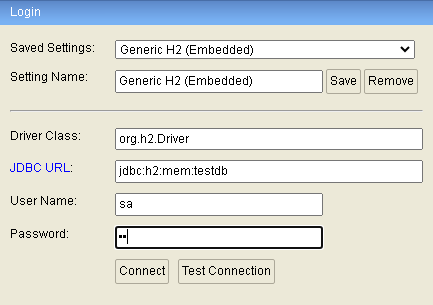

# Reba App
## _Challenge Reba_

## Autor
[Gustavo Ezequiel Lucero]

## Tareas

- Nivel 1 : Generar CRUD para el recurso persona
- Nivel 2-a: Extender la API para crear la relacion de padre entre las personas
- Nivel 2-b: Disponibilizar un endpoint para obtener la relaciòn "HERMAN@", "TÌ@", "PRIM@"
- Nivel 3: Disponibilizar un endpoint para obtener la demografìa por cada paìs
  .

## Tecnologías

- [Java] - Programming language for running cross-platform applications
- [Spring Boot] - Makes it easy to create stand-alone, production-grade Spring based Applications that you can "just run"
- [Lombok] - Project Lombok is a java library that automatically plugs into your editor and build tools, spicing up your java.
- [Maven] - A repository in Maven holds build artifacts and dependencies of varying types.
- [JUnit] - The goal is to create an up-to-date foundation for developer-side testing on the JVM
- [Mockito] - A mocking framework that tastes really good. It lets you write beautiful tests with a clean & simple API
-  [H2] - Is free SQL database written in Java.
- [Railway] - Is an infrastructure platform where you can provision infrastructure, develop with that infrastructure locally, and then deploy to the cloud.
- [JMeter] - An application is open source software, a 100% pure Java application designed to load test functional behavior and measure performance

La API se encuentra disponible en un [repositorio público][gitlab] en GitLab

## Documentación

### [Swagger][swagger]

## Notas
* Se decidió cambiar las URIs de las consigna de español a inglés para mantener un mismo criterio
* En el Nivel 2 se decidio cambiar el endpoint de _personas/{id1}/padre/{id2}_ a _relaciones/{id}/padre/{id2}_ para mayor legibilidad de la responsabilidad del endpoint
* En el endpoint _/relationships/{id1}/{id2}_ la relación es de izquierda a derecha para el caso de TI@, donde id1 es TI@ de id2 pero de forma inversa NO EXISTE RELACIÓN, en el resto de los casos la relación es ambivalente
* Se hace por defecto un _INSERT_ con 10 registros de personas
* Para facilitar las pruebas en el insert por defecto existen 3 relaciones
    * 2 y 3 HERMAN@
    * 2 Y 4 TI@
    * 4 y 5 PRIM@
* La base de datos utilizada es H2 SQL se puede acceder desde [aquí][h2] con la siguiente configuración:
    * password: sa

[Java]: <https://www.java.com/es/>
[Spring Boot]: <https://spring.io/projects/spring-boot>
[Lombok]: <https://projectlombok.org/>
[Maven]: <https://maven.apache.org/>
[JUnit]: <https://junit.org/junit5/docs/current/user-guide/>
[Mockito]: <https://site.mockito.org/>
[Railway]: <https://railway.app/>
[JMeter]: <https://jmeter.apache.org/>
[Gustavo Ezequiel Lucero]: <https://www.linkedin.com/in/gustavo-ezequiel-lucero-2a8250103/>
[gitlab]: <https://gitlab.com/gustavolucero1989/rebaapp/-/tree/main?ref_type=heads>
[h2]: <https://www.h2database.com/html/main.html>
[swagger]: <https://rebaapp-production.up.railway.app/swagger-ui.html>